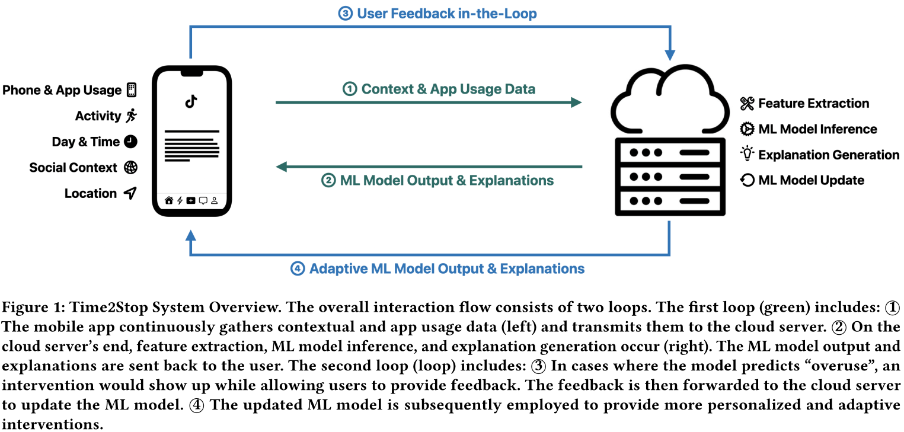
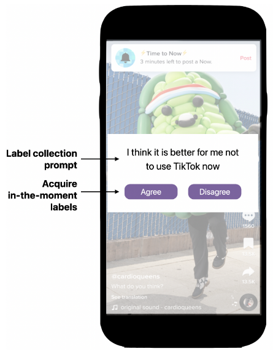
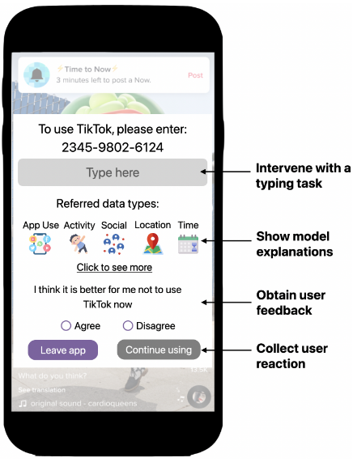
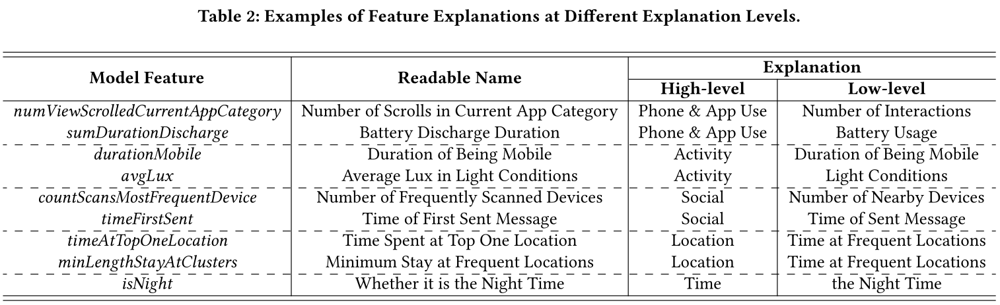
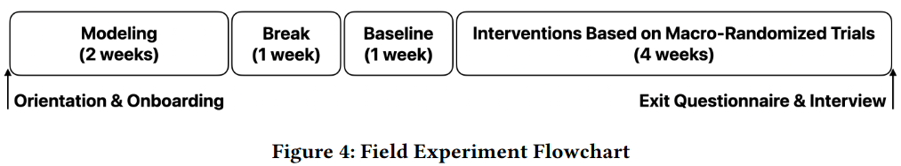
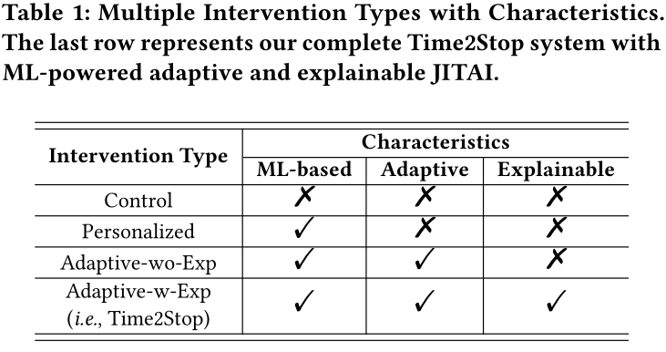

# Time2Stop
<!-- _header: 'Journal Club #1' -->
 ## Adaptive and Explainable Human-AI Loop for Smartphone Overuse Intervention

CHI 24

Jian Zheng
as an appreciative presenter with some _comments & questions_

06/18/2025

---

---
# Smartphone Overuse
<!-- paginate: true -->
<!-- header: 'Introduction'  -->

- _Problematic Smartphone Usage_
- Consequences
  * Physical health: headaches, chronic neck pain, sleep disturbance
  * Mental well-being: anxiety, depression, impaired cognitive abilities
  * Social wellness: distraction, family conflicts,  performance degradation

* Existing digital intervention tools
  * Often rely on **simple criteria** like pre-determined intervals or app-specific triggers

---

# Just-In-Time Adaptive Intervention (JITAI)

- To deliver tailored and timely support
- Dynamically adapts to users' internal and external contexts
- When the user is both **vulnerable** (susceptible to overuse) and **receptive** (able to process the intervention)
- Can be **rule-based** (predefined rules by experts) or **AI-based** (leverages ML to analyze data and identify patterns)

---

# Explainable AI (XAI)

- Addresses the challenges of interpretability and transparency 
- Helps users comprehend AI decisions, fostering trust 
- Can activate System 2 thinking (reasoning and analytical system)

Dual process theory

---

# Identifying the Research Gap

* AI-based JITAI for Smartphone Overuse
  * Very little prior work, which are rule-based
  * Without a human-in-the-loop setup

* Integrating XAI into JITAI-based Smartphone Interventions
  * Unexplored in prior work
  * Potential to improve transparency, handle confusion, and cultivate user trust

---

# What is Time2Stop?

<!-- header: 'Design of Time2Stop' -->

An intelligent, adaptive, and explainable JITAI system

* Intelligent: leverages machine learning
* Adaptive: collects user feedback to adapt the intervention model over time
* Explainable: introduces interventions with AI explanations
* JIT: intervenes at the optimal intervention timings

---

# System Overview

---

# ML Pipeline: Feature Design

(1) Phone and App Usage
- Locking & unlocking of the screen
- Battery usage: consumption rate, charge status
- App usage: count, min, max, mean, SD, sum of frequency and time 
- Input interactions: scrolling, tapping, focusing
- Notifications

(2) Activity
- Stationary and mobile durations
- Ambient light

---

# ML Pipeline: Feature Design (Cont.)

(3) Social Context
- Text message-derived features (e.g., first message time, top contacts)
- Bluetooth signals as a proxy for social contexts

(4) Location
- Location type, variance, entropy
- Time at the most-visited places, time at home

(5) Time - An objective temporal feature

*Is it collecting too many data?*

---

# ML Pipeline: Label Collection

- Ecological momentary assessment (EMA) 
  - Whether users are overusing the phones 
  - Ensures timely, contextually relevant labels 

- Three in-the-moment label collection rules:
  - Entry-moment: opening a monitored app
  - Leaving-moment: leaving a monitored app
  - During Usage: every 10 minutes during usage
    - *Is 10 minutes granular enough?*

- A _unknown_ cool-down interval

---

# ML Pipeline: Adaptive Model Updates

- User feedback (optional) serves as new labels for updates.

- Daily updates from 12 AM to 1 AM 

- Adopts decay-based sample weight assignment (recent data receives relatively higher weights)
  - Most recent day's weight: 1.0
  - Linearly decreases to 0.5 every half-week
- To capture current trends while gradually reducing the impact of outdated information

---

# ML Pipeline: Model Explanation Generation

- The top features contributing to an "overuse" prediction, calculated with SHapley Additive exPlanations (SHAP)

- Two Explanation Detail Levels:
  - High-level: (up to three) feature categories (e.g., "location," "activity," "app usage")
  - Low-level: feature description (e.g., "time at frequent locations")

- High-level explanations by default, low-level explanations by clicking the icons.

---

# Examples of Explanantion

_How would you feel upon seeing each explanation?_

---

# Intervention

- Users select their "monitored apps"
- ML model predicts __"overuse" or not__ based on current context and app usage upon app launching and every five minutes afterward. 
  - _Is five minutes granular enough?_
- If "overuse", type 12 randomly generated digits to __continue using__, or directly __leave app__
- Neither easily circumvented nor overly restrictive
  - _How restrictive or annoying is it?_

---

# System Overview

---
# Participants

<!-- header: 'Evalution' -->

- Recruited from university community forums 
- Selected based on Android smartphone use and high Smartphone Addiction Scale (SAS) score (>120) 
- 71 participants completed the study (48 females, 23 males; aged 21.8 ± 2.3, range 18-27) 
  - Initial 127 participants
  - 49 discontinued due to personal reasons, software/hardware issues, compatibility, privacy, or battery concerns 
  - 7 more excluded for insufficient data
  - _71/127 = 56%_

---

# Procedure

- Modeling (2 weeks): to collect features and labels for the initial models training
- Break (1 week): to mitigate carry-over effects from label collection
  - Label collection may affect phone usage. 
  - _What about the label collection for models updating?_
- Baseline (1 week): to collect app usage data with no intervention
- Intervention (4 weeks): daily micro-randomized trials of four interventions

---

# Intervention

_What shoud the Control group be like based on the research gap?_

---

# Intervention (Cont.)

- Control: intervened based on a fixed probability derived from each participant's percentage of __overuse__ during the initial modeling phase
- Personalized: the user's own data has a higher weight (10:1) to other users' data

---

# Intervention (Cont.)

- Interface for Control, Personalized, and Adaptive-wo-Exp was identical _(i.e., no explanation)_ to reduce bias. 
  - _Which should be the baseline for the Adaptive-w-Exp? No Exp, or random Exp?_

---

# Order of the Four Conditions

Micro-Randomized Trials (MRT). 
- A technique optimized for JITAI within mHealth. 
- Within-subject design: Each participant experienced all four intervention types. 
- Intervention type was altered on a daily basis. 
- Latin Square design (n=4) used to diversify the order and reduce order effects. 
- Participants were __not informed__ of the specific order or dates of intervention types during the study to reduce cognitive bias.
  - _But were they blind to what condition they were in each day?_

---

# Evaluation Metrics — Quantitative

1. Intervention Accuracy: proportion of interventions marked as "correct"
2. Intervention Receptivity: proportion of interventions responded by "leaving app"
   - _What are accuracy and receptivity? What is the relationship between them?_

3. App Usage Duration: __total__ time spent on monitored applications
   - “The average time spent on monitored apps during the baseline week was 214.00 minutes (SD = 103.57).” (Page 12, Section 6.4.2)

4. App Visit Frequency: number of times monitored applications were launched

_total time = average session length * visit frequency. Which part should be affected?_

---

# Evaluation Metrics — Qualitative

## Post-Study Questionnaire  
- Participants were informed of the exact dates for each intervention type at the end _(of the four-week)_ to aid recall.  
- To rank the four intervention types based on their preferences.  
- To rate perceived accuracy, effectiveness, and level of trust for each type.

## Semi-structured Exit Interviews  
- Questions: "What do you think of the four intervention techniques?" "Reason behind preference ranking?" "Thoughts on explanations?"  
- Analyzed using thematic analysis

---

<!-- header: 'Results' -->

