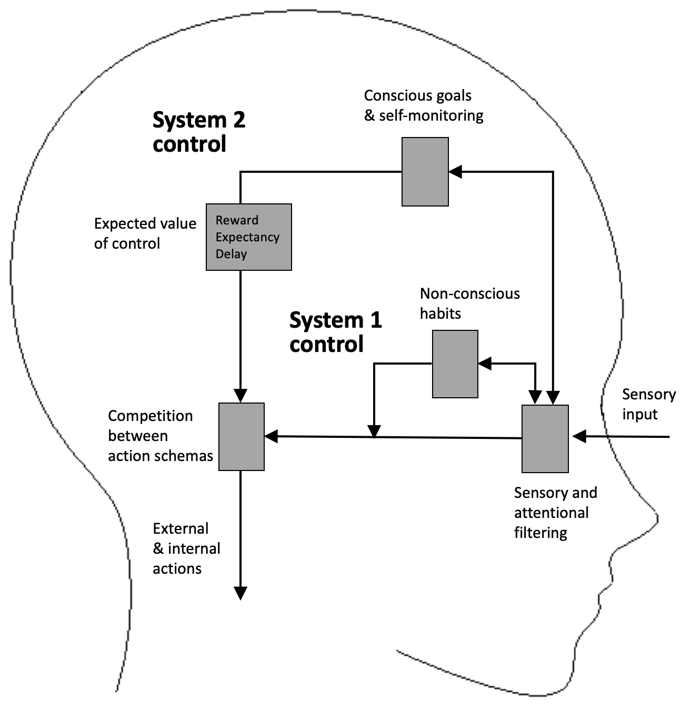

# Time2Stop
<!-- _header: 'Journal Club #1' -->
Adaptive and Explainable Human-AI Loop for Smartphone Overuse Intervention

CHI 24

_Jian Zheng_
06/18/2025

---

---

# Content

<!-- paginate: true -->

- The paper
    - Introduction
    - Time2Stop
    - Evaluation
    - Results
    - Discussion
- Discussion

---
# Smartphone Overuse
<!-- header: 'Introduction'  -->

- _Problematic Smartphone Usage_
- Consequences
  * Physical health: headaches, chronic neck pain, sleep disturbance
  * Mental well-being: anxiety, depression, impaired cognitive abilities
  * Social wellness: distraction, family conflicts,  performance degradation

* Existing digital intervention tools
  * Often rely on **simple criteria** like pre-determined intervals or app-specific triggers

---

# Just-In-Time Adaptive Intervention (JITAI)

- To deliver tailored and timely support
- Dynamically adapts to users' internal and external contexts
- When the user is both **vulnerable** (susceptible to overuse) and **receptive** (able to process the intervention)
- Can be **rule-based** (predefined rules by experts) or **AI-based** (leverages ML to analyze data and identify patterns)

---

# Explainable AI (XAI)

<!-- _class: lead -->

- Addresses the challenges of interpretability and transparency 
- Helps users comprehend AI decisions, fostering trust 
- Can activate System 2 thinking (reasoning and analytical system)

---

# Identifying the Research Gap

* AI-based JITAI for Smartphone Overuse
  * Very little prior work, which are rule-based
  * Without a human-in-the-loop setup

* Integrating XAI into JITAI-based Smartphone Interventions
  * Unexplored in prior work
  * Potential to improve transparency, handle confusion, and cultivate user trust

---

# Time2Stop

<!-- header: 'Time2Stop' -->

Time2Stop is an intelligent, adaptive, and explainable JITAI system for smartphone overuse intervention.

* Intelligent: Leverages machine learning
* Adaptive: Collects user feedback to adapt the intervention model over time
* Explainable: Introduces interventions with AI explanations
* JIT: Intervenes at the optimal intervention timings