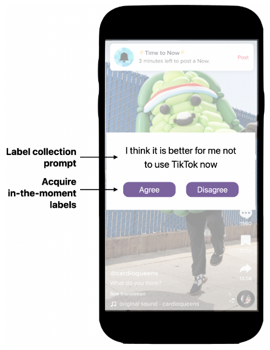

# Time2Stop
<!-- _header: 'Journal Club #1' -->
 ## Adaptive and Explainable Human-AI Loop for Smartphone Overuse Intervention

CHI 24

Jian Zheng
as an appreciative presenter with some _comments & questions_

_Why I chose this paper?_

06/18/2025

---

---
# Contents

1. Introduction  ..............  4–7
2. Design of Time2Stop  .......  8–17
3. Evalution  .................  18–25
4. Results  ...................  26–38
5. Discussion  ................  39–41

---
# Smartphone Overuse
<!-- paginate: true -->
<!-- header: 'Introduction'  -->

- _Problematic Smartphone Usage_
- Consequences
  - Physical health: headaches, chronic neck pain, sleep disturbance
  - Mental well-being: anxiety, depression, impaired cognitive abilities
  - Social wellness: distraction, family conflicts,  performance degradation

- Existing digital intervention tools
  - Often rely on **simple criteria** like pre-determined intervals or app-specific triggers

---

# Just-In-Time Adaptive Intervention (JITAI)

- To deliver tailored and timely support
- Dynamically adapts to users' internal and external contexts
- When the user is both **vulnerable** (susceptible to overuse) and **receptive** (able to process the intervention)
- Can be **rule-based** (predefined rules by experts) or **AI-based** (leverages ML to analyze data and identify patterns)

---

# Explainable AI (XAI)

- Addresses the challenges of interpretability and transparency 
- Helps users comprehend AI decisions, fostering trust 
- Can activate System 2 thinking (reasoning and analytical system)

Dual process theory

---

# Identifying the Research Gap

- AI-based JITAI for Smartphone Overuse
  - Very little prior work, which are rule-based
  - Without a human-in-the-loop setup

- Integrating XAI into JITAI-based Smartphone Interventions
  - Unexplored in prior work
  - Potential to improve transparency, handle confusion, and cultivate user trust

---

# What is Time2Stop?

<!-- header: 'Design of Time2Stop' -->

An intelligent, adaptive, and explainable JITAI system

- Intelligent: leverages machine learning
- Adaptive: collects user feedback to adapt the intervention model over time
- Explainable: introduces interventions with AI explanations
- JIT: intervenes at the optimal intervention timings
* _How to isolate the effect of each feature?_

---

# System Overview

---

# ML Pipeline: Feature Design

(1) Phone and App Usage
- Locking & unlocking of the screen
- Battery usage: consumption rate, charge status
- App usage: count, min, max, mean, SD, sum of frequency and time 
- Input interactions: scrolling, tapping, focusing
- Notifications

(2) Activity
- Stationary and mobile durations
- Ambient light

---

# ML Pipeline: Feature Design (Cont.)

(3) Social Context
- Text message-derived features (e.g., first message time, top contacts)
- Bluetooth signals as a proxy for social contexts

(4) Location
- Location type, variance, entropy
- Time at the most-visited places, time at home

(5) Time - An objective temporal feature

*Is it collecting too many data? Will demographic data be useful?*

---

# ML Pipeline: Label Collection

- Ecological momentary assessment (EMA) 
  - _Experience sampling method (ESM)_
  - Whether users are overusing the phones 
  - Ensures timely, contextually relevant labels 

- Three in-the-moment label collection rules:
  - Entry-moment: opening a monitored app
  - Leaving-moment: leaving a monitored app
  - During Usage: every 10 minutes during usage
    * *Is 10 minutes granular enough?*

- A _unknown_ cool-down interval

---

# ML Pipeline: Adaptive Model Updates

- User feedback (optional) serves as new labels for updates.

- Daily updates from 12 AM to 1 AM 

- Adopts decay-based sample weight assignment (recent data receives relatively higher weights)
  - Most recent day's weight: 1.0
  - Linearly decreases to 0.5 every half-week
  - To capture current trends while gradually reducing the impact of outdated information

---

# ML Pipeline: Model Explanation Generation

- The top features contributing to an "overuse" prediction, calculated with SHapley Additive exPlanations (SHAP)

- Two Explanation Detail Levels:
  - High-level: (up to three) feature categories (e.g., "location," "activity," "app usage")
  - Low-level: feature description (e.g., "time at frequent locations")

- High-level explanations by default, low-level explanations by clicking the icons.

---

# Examples of Explanantion

* _How would you feel upon seeing each explanation?_

---

# Intervention

- Users select their "monitored apps"
- ML model predicts __"overuse" or not__ based on current context and app usage upon app launching and every five minutes afterward. 
  * _Is five minutes granular enough?_
- If "overuse", type 12 randomly generated digits to __continue using__, or directly __leave app__
- Neither easily circumvented nor overly restrictive
  * _How restrictive or annoying is it?_

---

# System Overview

---
# Participants

<!-- header: 'Evalution' -->

- Recruited from university community forums 
- Selected based on Android smartphone use and high Smartphone Addiction Scale (SAS) score (>120) 
- 71 participants completed the study (48 females, 23 males; aged 21.8 ± 2.3, range 18-27) 
  - Initial 127 participants
  - 49 discontinued due to personal reasons, software/hardware issues, compatibility, privacy, or battery concerns 
  - 7 more excluded for insufficient data
  * _71/127 = 56%_

---

# Procedure

- Modeling (2 weeks): to collect features and labels for the initial models training
- Break (1 week): to mitigate carry-over effects from label collection
  - Label collection may affect phone usage. 
- Baseline (1 week): to collect app usage data with no intervention
- Intervention (4 weeks): daily micro-randomized trials of four interventions
  * _What about the label collection for models updating here?_

---

# Intervention

* _What should the Control group be like based on the research gap?_
* _Other possibilities: Non-Personalized (Global), Personalized-w-Exp_

---

# Intervention (Cont.)

- Control: intervened based on a fixed probability derived from each participant's percentage of __overuse__ during the initial modeling phase
- Personalized: the user's own data has a higher weight (10:1) to other users' data

---

# Intervention (Cont.)

- Interface for Control, Personalized, and Adaptive-wo-Exp was identical _(i.e., no explanation)_ to reduce bias. 
  * _Which should be the baseline for the Adaptive-w-Exp? No Exp, or random Exp?_

---

# Order of the Four Conditions

Micro-Randomized Trials (MRT). 
- A technique optimized for JITAI within mHealth. 
- Within-subject design: Each participant experienced all four intervention types. 
- Intervention type was altered on a daily basis. 
- Latin Square design (n=4) used to diversify the order and reduce order effects. 
- Participants were __not informed__ of the specific order or dates of intervention types during the study to reduce cognitive bias.
  * _But were they blind to what condition they were in each day?_

---

# Evaluation Metrics — Quantitative

1. Intervention Accuracy: proportion of interventions marked as "correct"
2. Intervention Receptivity: proportion of interventions responded by "leaving app"
   * _What are accuracy and receptivity? What is the relationship between them?_

3. App Usage Duration: __total__ time spent on monitored applications
   - “The average time spent on monitored apps during the baseline week was 214.00 minutes (SD = 103.57).” (Page 12, Section 6.4.2)

4. App Visit Frequency: number of times monitored applications were launched
    * _Not about stopping, but __starting__ the usage_

* _total time = average session length * visit frequency. Which part should be affected?_

---

# Evaluation Metrics — Qualitative

- Post-Study Questionnaire _(qualitative?)_ 
  - Participants were informed of the exact dates for each intervention type at the end _(of the four-week)_ to aid recall.  
  - To rank the four intervention types based on their preferences.  
  - To rate perceived accuracy, effectiveness, and level of trust for each type.

- Semi-structured Exit Interviews  
  - Questions: "What do you think of the four intervention techniques?" "Reason behind preference ranking?" "Thoughts on explanations?"  
  - Analyzed using thematic analysis

--- 

_I will not follow the structure of the paper in reporting the results._

# Data Overview

<!-- header: 'Results' -->

- Collected Data
  - 497,458 minutes of usage from 149 apps (17 ± 5 apps per person)
  - 207,898 app sessions
  - 75,670 modeling-phase labels (60.5% entry, 24.5% using, 14.9% exit) 
    * _Why so much difference between the three types?_
  - 39,188 intervention-phase labels (user feedback)

---

# Model, Feature, & Intervention Frequency

- **Random Forest** performed better (F1 = 66.7%) than NB, LR, SVM, DT, & KNN 

- Key Features
  - Phone unlock duration _(current session length)_
  - Movement patterns (travel distance, static ratio)
  - Nighttime usage

- Control sent more interventions than the other three conditions 
  * _How to interpret this?_

---
# Quantitative Results

- Four _(or five)_ metrics
  - Accuracy ("Yes, I agree I am overusing it.")
  - Receptivity (Choosing "leaving app")
  - Visit frequency (I opened Twitter __10__ times today)
  - _Session length (Each time I spent __5__ minutes in Twitter)_
  - Total time (I spent __50__ minutes in Twitter today)
- Four groups: Control, Personalized, Adaptive-wo-Exp, Adaptive-w-Exp

- What is effect of Adaptation and Explanation? 
  - [Click here to make your prediction](https://docs.google.com/spreadsheets/d/1sMDD2J7CTZq2pIjn0F8CSjEEx9UH6mcvJD2H2lqyHJU/edit?usp=sharing)

---

# Adaptation → Accuracy & Receptivity

- Normalized data against Control, _original data not provided_
- Adaptive = Adaptive-wo-Exp and Adaptive-w-Exp merged
  - _Or should we just use Adaptive-wo-Exp?_
- Accuracy: Adaptive outperformed Personalized
- Receptivity: Comparison between Adaptive and Personalized not reported
* _Is the effect coming from the adaptivity or explanation?_

---

# Adaptation → Accuracy & Receptivity _(Mine)_

- _If we compare Adaptive-wo-Exp (blue) with Personalized (yellow)_
  - _Accuracy: not reported_
  - _Receptivity: not reported_
* _I will not say that adaptation alone improved accuracy or receptivity._

---

# Adaptation &rarr; Usage Behavior

- Normalized data against _what? Why baseline is not 1.0?_
- Visit frequency
  - Adaptive-wo-Exp (blue) was fewer (8.9%) than __baseline__ (p < 0.01)
  - Adaptive-w-Exp (green) was marginally fewer (7.0%) than __baseline__ (p = 0.07)
  - "This showed the advantage of the two adaptive methods over the Personalized and Control methods." (Page 12, Section 6.4.1) _really?_
- Total time: no significant difference 

---

# Adaptation &rarr; Usage Behavior _(Mine)_

- _What about session length?_
- _I calculated the session length:_

* _I guess there was no difference in session length between groups._

---

# Summary of Adaptation's Effect

- Accuracy
  - Adaptive-w-Exp and Adaptive-wo-Exp combined, better then Personalized
  - Adaptive-wo-Exp alone, better than Control but not better than Personalized
- Receptivity. Better than Control but not better than Personalized
- Visit frequency. Fewer than baseline, but not Control or Personalized.
- Session length. No effect
- Total time. No effect

"Adaptive models significantly outperform the baseline methods on intervention accuracy and receptivity." (Abstract)
_Adaptation alone did not improve beyond Personalized_

---

# Explanation &rarr; Accuracy & Receptivity

- Accuracy: Adaptive-w-Exp outperformed Adaptive-wo-Exp
- Receptivity: Adaptive-w-Exp marginally outperformed Adaptive-wo-Exp

Explanation improved accuracy and Receptivity.

---

# Explanation &rarr; Usage Behavior

- Visit frequency
  - Adaptive-w-Exp (green) was marginally fewer (7.0%) than __baseline__ (p = 0.07)
- Total time: no significant difference 
- _Session length: no significant difference_

The comparison between Adaptive-w-Exp and Adaptive-w-Exp suggested that adding explanation increased (insignificantly) the visit frequency and total time. 

---

# Results from the Questionnaire

"the intervention order was presented to participants. They then filled out the questionnaire" (Page 9, Section 5.2)
_It will be more convincing if interventions were refereed as A, B, C, & D._
_Is Adaptive-w-Exp ranked higher than Adaptive-wo-Exp?_

---

# Results from the Interview

- General preference for adaptive intervention methods. 
  - Participants "felt the difference" as adaptive versions "had been learning" about their behavior, leading to more "comfortable" intervention timing over time. 
- Mixed reaction to the explanation
  - Some found explanations fostered self-awareness, prompted reflection, and built trust 
  - Others viewed them as "overly broad," confusing, or "unnecessary"

---

# Summary of the results

- Control condition (random intervention) reduced visit frequency (and thus total time) but not session length.
- Personalized condition outperformed Control in accuracy and receptivity but not in usage behavior change.
- Adaptive-wo-Exp had similar performance to Personalized condition.
- Adaptive-w-Exp outperformed Adaptive-wo-Exp in accuracy and (marginally) receptivity but not in usage behavior (actual insignificantly worse than Adaptive-wo-Exp).

---
# What are accuracy, receptivity, & the gap in between?

<!-- header: 'Discussion' -->

---

# More Advanced Explanation Generation?

"Although most participants found explanations helpful for self-reflection, some found explanations confusing and overly broad.

This illustrates the need for **more advanced explanation generation techniques** in future deployment." (Page 15, Section 7.1)

* _Is explanation always necessary and beneficial?_

---

# Thank you!

- The slides are made with [Marp](https://marp.app/), [Marp for VS Code](https://marketplace.visualstudio.com/items?itemName=marp-team.marp-vscode), and [Marp CLI](https://github.com/marp-team/marp-cli).
  - Theme [academic](https://github.com/kaisugi/marp-theme-academic) by [Kaito Sugimoto](https://github.com/kaisugi), slightly modified by me
  - Some scripts are generated by ChatGPT.
- I will keep the [repository](https://github.com/jzheng23/Time2Stop-slides) public until the end of the week if anyone is interested. 